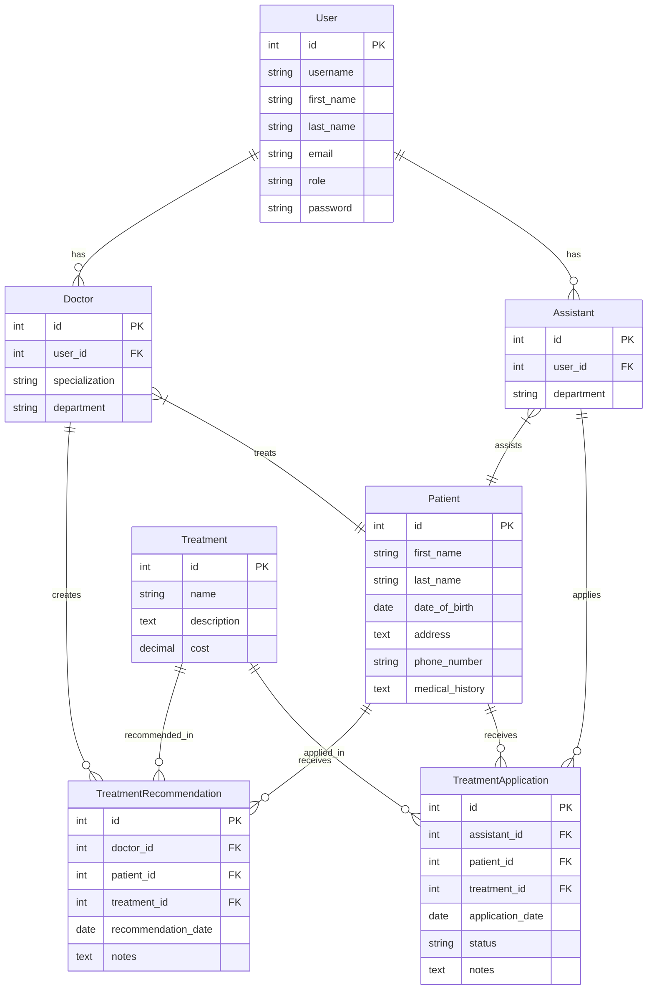

# Hospital Management System - Entity Relationship Diagram

This diagram represents the relationships between different entities in the Hospital Management System. Here's a breakdown of the relationships:

1. **User Management**
   - Users can be either Doctors or Assistants (one-to-one relationship)
   - Each user has basic information like username, name, email, and role

2. **Doctor-Patient Relationship**
   - Doctors can treat multiple patients (many-to-many relationship)
   - Each patient can be treated by multiple doctors

3. **Assistant-Patient Relationship**
   - Assistants can assist multiple patients (many-to-many relationship)
   - Each patient can have multiple assistants

4. **Treatment Management**
   - Doctors can create treatment recommendations for patients
   - Assistants can apply treatments to patients
   - Each treatment can be recommended or applied multiple times

5. **Treatment Status Tracking**
   - Treatment applications have a status (Pending, In Progress, Completed)
   - Both recommendations and applications include notes for additional information

The system follows a role-based access control system where:
- General Managers (GM) have full access to all entities
- Doctors (DR) can manage their patients and create treatment recommendations
- Assistants (AS) can manage assigned patients and apply treatments 